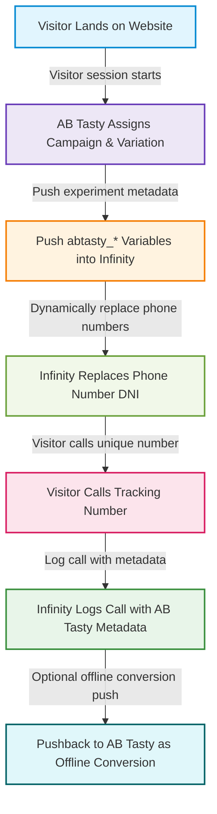

# AB Tasty ⇄ Infinity Integration Guide

## 1. Overview

This integration enables marketing and analytics teams to accurately attribute phone calls and offline conversions to AB Tasty experiments. Key benefits include:

- Persistent tracking of AB Tasty exposure for visitor sessions  
- Linking phone calls to the correct experiment variant  
- Pushing offline conversions back into AB Tasty for complete attribution  



## 2. Current Integration Limitations

- Only tracks phone calls (goals) in Infinity  
- Cannot handle CRM transactional data via Events API or Smart Match  
- Lacks persistent variable support across sessions  

## 3. New Infinity Scope

### 3.1 Collecting Variables

Infinity can capture custom JS variables in a visitor session using the `_its('setVariable', ...)` method. Variables support different scopes:

| Scope | Behaviour |
|-------|-----------|
| `page` | Default, applies only to the current page |
| `land` | Persists until the next landing page; updated only on new landings |
| `visit` | Persists for the session; updated only if not previously set |

**Example:**

```javascript
window._its('setVariable', 'abtasty_campaignId', abtasty_campaignId, 'visit');
```

Variables are prefixed with `c_` in Infinity API, e.g. `c_abtasty_campaignId`.

### 3.2 Infinity API

The **Triggers API** allows retrieval of calls and other Goal data. Example request:

```http
GET https://api.infinitycloud.com/reports/v2/igrps/{IGRP_ID}/triggers/goals?startDate=2025-10-01&endDate=2025-10-31&limit=500&display[]=c_abtasty_campaignId&display[]=c_abtasty_variationId
```

- `{IGRP_ID}`: Infinity Installation ID  
- `display[]`: Filter for AB Tasty variables  
- Authentication: API key required ([docs](https://kb.infinity.co/service/api/v2.1_authorisation.html))  

### 3.3 Webhooks

- Infinity can push call data to AB Tasty via **GET/POST webhooks**  
- Webhooks are unauthenticated  
- Suitable for automating pushes with AB Tasty variables  

## 4. Integration Flow

### 4.1 Visitor Lands on Website
- Infinity script (`nas.v1.min.js`) initializes a **visitor session/profile**  
- AB Tasty assigns a **campaign** and **variation**  

### 4.2 AB Tasty Exposure Callback
Push AB Tasty metadata to Infinity:

```javascript
_ictt.push(['_setCustomVar', 'abtasty_campaignId', data.campaignId]);
_ictt.push(['_setCustomVar', 'abtasty_campaignName', data.campaignName]);
_ictt.push(['_setCustomVar', 'abtasty_variationId', data.variationId]);
_ictt.push(['_setCustomVar', 'abtasty_variationName', data.variationName]);
```

Include `_ictt` (Infinity session token) for linking.

### 4.3 Dynamic Number Insertion (DNI)
- Infinity replaces the on-page number with a **unique tracking number**  
- Number is tied to `_ictt` and AB Tasty metadata  

### 4.4 Call Tracking
- Call data logged with:
  - Visitor session ID  
  - Infinity session token `_ictt`  
  - AB Tasty campaign/variation  
  - Attribution data (UTMs, referrer, source)  

### 4.5 Reporting and Pushback
- AB Tasty integration enables **offline conversion pushback**  
- Conversions are attributed to the correct campaign/variation  

## 5. Example AB Tasty → Infinity Snippet

```html
<script type="text/javascript">
  (function() {
    var ict = document.createElement('script');
    ict.async = true;
    ict.src = (document.location.protocol === 'https:' ? 'https://' : 'http://') 
              + 'ict.infinity-tracking.net/js/nas.v1.min.js';
    document.getElementsByTagName('script')[0].parentNode.insertBefore(ict, document.getElementsByTagName('script')[0]);
  })();

  window.ABTastyExposure = function(data) {
    function tryPush() {
      if (window._ictt && typeof _ictt.push === 'function') {
        _ictt.push(['_setCustomVar', 'abtasty_campaignId', data.campaignId]);
        _ictt.push(['_setCustomVar', 'abtasty_campaignName', data.campaignName]);
        _ictt.push(['_setCustomVar', 'abtasty_variationId', data.variationId]);
        _ictt.push(['_setCustomVar', 'abtasty_variationName', data.variationName]);
      } else {
        setTimeout(tryPush, 200);
      }
    }
    tryPush();
  };
</script>
```

## 6. Sample Call Record

```json
{
  "callId": "C123456789",
  "callerNumber": "+44 7700 900123",
  "trackingNumber": "+44 203 555 6789",
  "callStartTime": "2025-09-29T14:35:12Z",
  "callDurationSeconds": 125,
  "callStatus": "Answered",
  "sessionId": "S987654321",
  "_ictt": "IC_abcdef123456",
  "utmSource": "google",
  "utmMedium": "cpc",
  "utmCampaign": "fall_sale",
  "referrer": "https://www.example.com/product-page",
  "abtasty_campaignId": "1509468",
  "abtasty_campaignName": "Homepage Banner Test",
  "abtasty_variationId": "1880577",
  "abtasty_variationName": "Green Button Variant",
  "callRecordingUrl": "https://recordings.infinity.co/C123456789.mp3",
  "callNotes": "Lead qualified"
}
```

## 7. Infinity → AB Tasty Event Mapping

### Event-to-Segment Mapping

```javascript
const eventToSegmentMap = {
  callCompleted: "booked",
  purchaseCompleted: "purchased"
};
```

### Event Handling

```javascript
const processedEvents = new Set();

function handleInfinityEvent(event) {
  if (!event || processedEvents.has(event.id)) return;
  const segmentName = eventToSegmentMap[event.type];
  if (!segmentName) return;
  processedEvents.add(event.id);
  sendToAbtasty(segmentName);
}

function sendToAbtasty(segmentName) {
  if (window.abtasty && typeof window.abtasty.send === "function") {
    window.abtasty.send("event", {
      ec: "User Interaction",
      ea: `Segment Assigned: ${segmentName}`,
      el: "Infinity → AB Tasty Sync",
      ev: 1
    });
  }
}
```

### Subscription & Polling

```javascript
// Real-time subscription
if (window._ictt && typeof window._ictt.on === "function") {
  Object.keys(eventToSegmentMap).forEach(eventType => {
    _ictt.on(eventType, handleInfinityEvent);
  });
}

// Polling fallback
setInterval(() => {
  if (!_ictt || !Array.isArray(_ictt.events)) return;
  _ictt.events.forEach(event => handleInfinityEvent(event));
}, 2000);
```

## 8. Key Notes

- AB Tasty SDK must be loaded before the script runs  
- Infinity events require unique `id` for deduplication  
- Polling interval can be adjusted for performance
